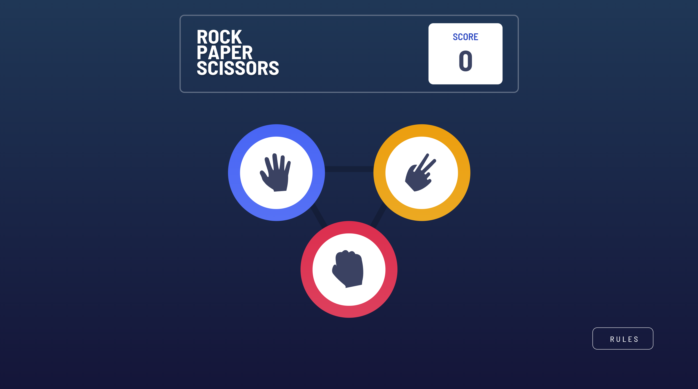
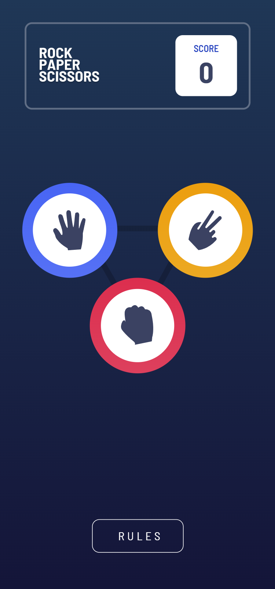

<h1 align="center">React Tip Calculator</h1>

This app was built with React and styled with SCSS.

It is a solution to the [Rock, Paper, Scissors challenge on Frontend Mentor](https://www.frontendmentor.io/challenges/rock-paper-scissors-game-pTgwgvgH).

## Links 🌟

- Live site: [Try it out here 💻](https://thethomasy.github.io/rock-paper-scissors/ 'Live View')

## Screenshots 📷

  
<!--    -->

## Built With 🛠

- React JS
- SCSS

## Future Updates 🎁

- [ ] Add effect around winning circle
- [ ] Add 3D effect to icon circles

## Changelog

- **[1.1] 14/12/21 Fix**:
Fixed position issue with mobile devices with small height. Also fixed crash when user clicks on an icon whilst on the battle board.

## Author 🧑

**Tom Young**

- [Github Profile 👨‍💻](https://github.com/TheThomasY)
- [Email ✉](mailto:tomyoungdev@gmail.com?subject=Hi 'Hi!')
- [LinkedIn 💼](https://www.linkedin.com/in/tom-young5555/)
- [Dev.to 🖊](https://dev.to/thetomy)

Give a ⭐️ if you like this project!
